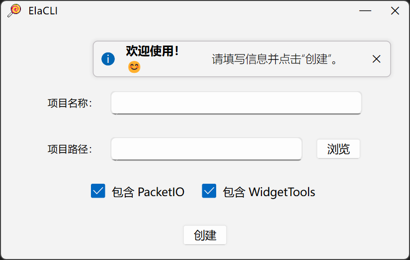

<div align=center>
   

# ElaCLI

</div>

## 介绍

这是一个用于快速生成 **[ElaWidgetTools😍](https://github.com/Liniyous/ElaWidgetTools)** 项目模板的工具。

<div align=center>
   
</div>

## 使用

1. 克隆本项目到本地

```shell
git clone https://github.com/liaozhangsheng/ElaCLI.git --recursive
```

> 也可不克隆子模块，但是需将 **ElaWidgetTools** 的编译产物放到 `ElaCLI/Install` 目录下。

2. 编译、安装

执行 install 命名。

生成的编译产物在 `Install` 目录下。

3. 运行
